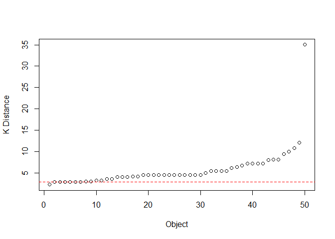

<!-- README.md is generated from README.Rmd. Please edit that file -->

# dmdbscan

<!-- badges: start -->
<!-- badges: end -->

The goal of dmdbscan is to determine the Epsilon Optimal Value (Eps) on
DBSCAN Algorithm. Users only need to input the data to be used and the K
value which will be the minimum point value (minPts). Then this function
will look for the optimal epsilon point according to the data
distribution and will produce a cluster that is formed.

## Installation

You can install the released version of dmdbscan from
[CRAN](https://CRAN.R-project.org) with:

``` r
install.packages("dmdbscan")
```

## Example

This is a basic example which shows you how to solve a common problem:

``` r
library(dmdbscan)
## basic example code
```

What is special about using `README.Rmd` instead of just `README.md`?
You can include R chunks like so:

``` r
dmdbscan(cars, 3)
```



    #> $cluster
    #>  [1] 0 0 0 0 1 0 1 2 0 1 2 0 1 2 2 2 3 3 0 2 3 0 0 0 2 0 0 4 0 4 0 4 0 0 0 0 0 0
    #> [39] 0 0 0 0 0 0 0 0 0 0 0 0
    #> 
    #> $eps
    #> [1] 2.828427
    #> 
    #> $MinPts
    #> [1] 3
    #> 
    #> $isseed
    #>  [1] FALSE FALSE FALSE FALSE FALSE FALSE  TRUE  TRUE FALSE FALSE  TRUE FALSE
    #> [13] FALSE  TRUE  TRUE  TRUE  TRUE  TRUE FALSE  TRUE  TRUE FALSE FALSE FALSE
    #> [25]  TRUE FALSE FALSE  TRUE FALSE  TRUE FALSE  TRUE FALSE FALSE FALSE FALSE
    #> [37] FALSE FALSE FALSE FALSE FALSE FALSE FALSE FALSE FALSE FALSE FALSE FALSE
    #> [49] FALSE FALSE
    #> 
    #> attr(,"class")
    #> [1] "dmdbscan"

You’ll still need to render `README.Rmd` regularly, to keep `README.md`
up-to-date. `devtools::build_readme()` is handy for this. You could also
use GitHub Actions to re-render `README.Rmd` every time you push. An
example workflow can be found here:
<https://github.com/r-lib/actions/tree/master/examples>.

You can also embed plots, for example:


In that case, don’t forget to commit and push the resulting figure
files, so they display on GitHub and CRAN.
